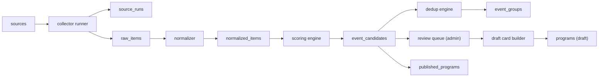
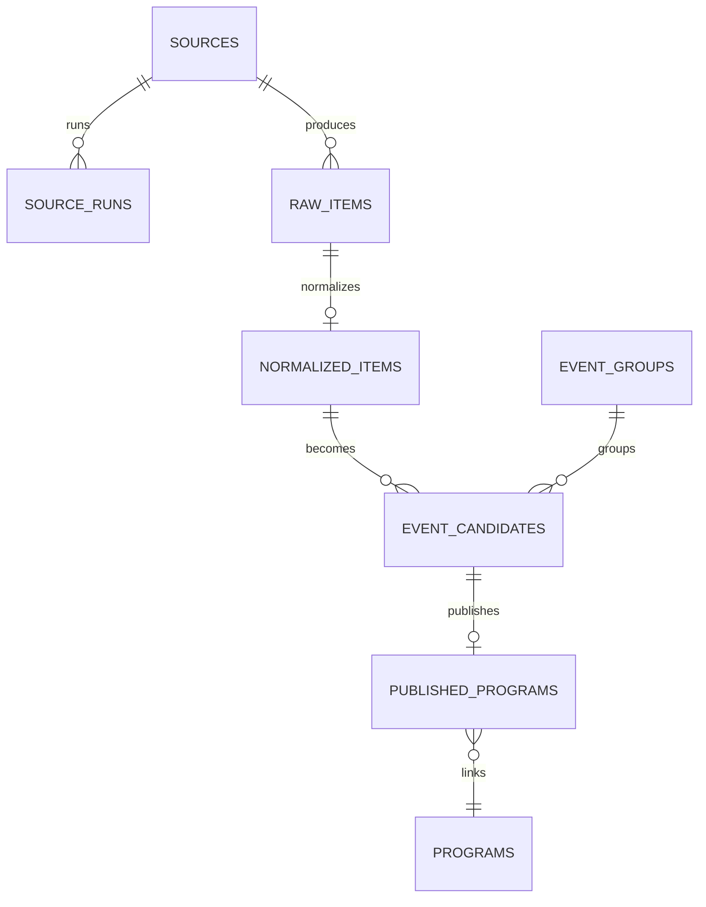

# Ingestion Module v1 — Architecture and Delivery Plan

Статус: proposal for implementation  
Дата: 2026-04-06  
Контекст: MyWave Travel / Tourism

---

## 1. Decision summary

### Final recommendation

Для **MVP v1** ingestion-модуль нужно строить **внутри текущего продукта**, а не как отдельный Python-сервис.

### Why

В проекте уже есть:

- `Node + Express` API
- `Prisma + PostgreSQL`
- `Next.js admin`
- существующие доменные сущности `organizers`, `programs`, `bookings`, `reviews`, `commissions`

Это означает, что для первого рабочего ingestion pipeline дешевле и быстрее:

1. добавить новые ingestion-таблицы в текущую PostgreSQL schema
2. добавить ingestion routes в текущий `services/api`
3. добавить review queue в текущий `apps/admin`
4. запускать collectors/normalization/dedup как worker/jobs слой рядом с текущим backend

### What not to do in v1

- не поднимать отдельный Python backend только ради ingestion
- не строить микросервисную схему
- не включать auto-publish
- не делать Instagram backbone

---

## 2. Architecture principles

### Product principle

Модуль ingestion не публикует программу сам по себе. Он только:

`находит -> сохраняет -> нормализует -> скорит -> группирует -> отправляет в review`

Публикация карточки происходит только после operator review.

### Domain principle

Нужно сохранить разделение между:

1. **discovery / scouting**
2. **canonical publish intake**

Это уже соответствует канону проекта:

- [INGESTION_POLICY.md](INGESTION_POLICY.md)
- [SOURCE_AND_PRESENTATION_POLICY_EMAIL.md](SOURCE_AND_PRESENTATION_POLICY_EMAIL.md)
- [INTAKE_AND_SITE_POLICY_ACCEPTANCE_EMAIL.md](INTAKE_AND_SITE_POLICY_ACCEPTANCE_EMAIL.md)

### Trust principle

Автоматически найденный анонс:

- не делает программу verified
- не делает организатора trusted
- не обходит publish gate

Trust/verification живут отдельно от ingestion discovery.

---

## 3. Target architecture

### Pipeline stages

#### Stage 1. Source Registry

Храним все подключённые источники и их настройки.

#### Stage 2. Collectors

По расписанию collectors читают RSS / Telegram / Instagram и складывают результат в raw storage.

#### Stage 3. Raw Store

Сохраняем payload как есть без бизнес-логики.

#### Stage 4. Normalization

Из сырых публикаций пытаемся выделить событие и его поля.

#### Stage 5. Scoring

Считаем пригодность объекта для review.

#### Stage 6. Dedup

Группируем повторы и выбираем канонический candidate.

#### Stage 7. Review Queue

Оператор принимает решение: approve / reject / merge.

#### Stage 8. Draft Card Builder

Из approved candidate создаётся `Program` в статусе `draft` или `internal_review`.

---

## 4. ERD

---

## 5. Data model

### `sources`

Назначение: реестр всех discovery-источников.

Поля:

- `id`
- `type` (`instagram | telegram | rss | site`)
- `name`
- `url_or_handle`
- `discipline`
- `country`
- `region`
- `language`
- `priority`
- `trust_score`
- `parser_profile`
- `fetch_interval_minutes`
- `is_active`
- `last_checked_at`
- `last_success_at`
- `meta_json`
- `created_at`
- `updated_at`

### `source_runs`

Назначение: история запусков collector/job по каждому source.

Поля:

- `id`
- `source_id`
- `started_at`
- `finished_at`
- `status`
- `items_found`
- `items_created`
- `error_message`
- `meta_json`

### `raw_items`

Назначение: долговечный слой сырых входящих публикаций.

Поля:

- `id`
- `source_id`
- `external_item_id`
- `source_type`
- `source_url`
- `author_name`
- `published_at`
- `raw_title`
- `raw_text`
- `raw_media_json`
- `raw_payload_json`
- `content_hash`
- `fetched_at`

### `normalized_items`

Назначение: нормализованный event-like объект после extraction.

Поля:

- `id`
- `raw_item_id`
- `event_type`
- `discipline`
- `title`
- `description_short`
- `description_full`
- `country`
- `region`
- `city`
- `venue`
- `start_date`
- `end_date`
- `duration_days`
- `level`
- `price_from`
- `currency`
- `organizer_name`
- `booking_url`
- `image_url`
- `confidence_score`
- `parse_version`
- `extracted_json`

### `event_candidates`

Назначение: объекты, попадающие в review queue.

Поля:

- `id`
- `normalized_item_id`
- `dedup_group_id`
- `status`
- `review_priority`
- `trust_score`
- `fit_score`
- `future_event_score`
- `duplicate_score`
- `final_score`
- `decision_notes`
- `reviewed_by`
- `reviewed_at`

Статусы:

- `new`
- `needs_review`
- `approved`
- `rejected`
- `merged`
- `published`
- `archived`

### `event_groups`

Назначение: хранение dedup clusters.

Поля:

- `id`
- `canonical_candidate_id`
- `group_key`
- `merge_status`
- `meta_json`

### `published_programs`

Назначение: связь между ingestion candidate и фактической карточкой.

Поля:

- `id`
- `candidate_id`
- `program_id`
- `published_at`
- `publish_status`
- `editor_notes`

---

## 6. Component map

### A. Source Registry

Зона ответственности:

- CRUD по источникам
- включение/отключение источника
- parser_profile
- fetch frequency
- trust baseline

### B. Collector Runner

Зона ответственности:

- запуск collector jobs
- source locking
- retry
- timeout
- status/logging
- запись в `source_runs`

### C. RSS Collector

Зона ответственности:

- читать RSS/Atom
- переводить feed items в raw format
- dedup на уровне `source_id + external_item_id`

### D. Telegram Collector

Зона ответственности:

- читать посты/сообщения из разрешённых источников
- собирать текст/медиа/ссылки
- сохранять в raw

### E. Instagram Collector

Зона ответственности:

- discovery only
- низкая степень доверия относительно RSS/site
- не может быть backbone источником

### F. Raw Store

Зона ответственности:

- ничего не интерпретировать
- только стабильно хранить входящий контент

### G. Normalizer

Зона ответственности:

- event extraction
- field mapping
- parse_version
- confidence

### H. Scoring Engine

Зона ответственности:

- `event_likelihood_score`
- `future_event_score`
- `completeness_score`
- `source_trust_score`
- `tourism_fit_score`
- `final_score`

### I. Dedup Engine

Зона ответственности:

- grouping
- merge priority
- canonical candidate selection

### J. Review Queue

Зона ответственности:

- список кандидатов
- фильтры
- detail view
- approve / reject / merge / publish draft

### K. Draft Card Builder

Зона ответственности:

- map approved candidate -> `Program`
- не публиковать автоматически
- писать linkage в `published_programs`

---

## 7. Dedup rules

### Match signals

- одинаковые или пересекающиеся даты
- одинаковая локация
- одинаковый организатор
- похожий `title`
- одинаковый `booking_url`
- схожий `content_hash`
- схожие media/caption

### Canonical source priority

1. официальный сайт / RSS
2. Telegram организатора
3. Instagram организатора
4. репосты / агрегаторы / обзоры

### Practical v1 rule

Для MVP не нужен тяжёлый fuzzy-ML dedup. Достаточно rule-based grouping:

- normalized organizer + city/region + start/end date bucket + normalized title fingerprint

---

## 8. Review and publish rules

### Hard rule

**Auto-publish disabled.**

Даже candidate с высоким score:

- не становится `published`
- не становится `verified`
- не обходит ручной review

### Publish path

`approved candidate` -> `create draft program` -> existing `publish gate` -> operator decision

### Important domain note

`Program.intakeSource` в текущем проекте уже означает канонический путь попадания программы в каталог, а не discovery source.

Поэтому:

- discovery provenance надо хранить в ingestion tables
- в `Program` после ручного draft build разумно писать `admin_manual`
- доверие к организатору и trust статусы должны оставаться независимыми

---

## 9. API v1

### Sources

- `GET /api/sources`
- `POST /api/sources`
- `PATCH /api/sources/{id}`
- `POST /api/sources/{id}/run`

### Raw

- `GET /api/raw-items`
- `GET /api/raw-items/{id}`

### Candidates

- `GET /api/event-candidates`
- `GET /api/event-candidates/{id}`
- `POST /api/event-candidates/{id}/approve`
- `POST /api/event-candidates/{id}/reject`
- `POST /api/event-candidates/{id}/merge`
- `POST /api/event-candidates/{id}/publish`

### Jobs

- `GET /api/jobs`
- `POST /api/jobs/run-ingestion`
- `POST /api/jobs/run-normalization`
- `POST /api/jobs/run-dedup`

---

## 10. Recommended implementation in current repo

### Backend

Использовать текущий стек:

- `services/api`
- `Express`
- `Prisma`
- `PostgreSQL`

### Admin UI

Добавить страницы:

- `apps/admin/src/app/sources`
- `apps/admin/src/app/raw-items`
- `apps/admin/src/app/event-candidates`

### Workers

Добавить ingestion jobs как отдельный TS worker layer, например:

- `services/api/src/workers/ingestion/runner.ts`
- `services/api/src/workers/ingestion/rssCollector.ts`
- `services/api/src/workers/ingestion/telegramCollector.ts`
- `services/api/src/workers/ingestion/normalize.ts`
- `services/api/src/workers/ingestion/dedup.ts`

### Scheduling

Для MVP достаточно:

- ручной job trigger через API
- простой cron/interval runner внутри worker process

Отдельная job-infra вроде Celery/Dramatiq для текущего этапа не обязательна.

---

## 11. Sprint backlog

### Sprint 1 — Vertical slice RSS

Цель:

`sources -> rss collector -> raw_items -> normalized_items -> event_candidates -> review list`

Задачи:

1. добавить ingestion tables в Prisma
2. реализовать `sources` CRUD
3. реализовать `source_runs`
4. реализовать `raw_items`
5. реализовать `rss collector`
6. реализовать базовый normalizer
7. реализовать scoring
8. реализовать `event_candidates`
9. сделать admin review list

Результат:

- можно завести RSS source
- можно руками запустить ingestion
- публикации доходят до review queue

### Sprint 2 — Review workflow

Задачи:

1. candidate detail view
2. approve / reject
3. базовый dedup + `event_groups`
4. merge flow
5. run history UI
6. error visibility

Результат:

- очередь review становится рабочей для оператора

### Sprint 3 — Draft card builder

Задачи:

1. publish candidate -> create `Program draft`
2. linkage через `published_programs`
3. backfill editor notes
4. traceability candidate -> program

Результат:

- approved candidate можно превратить в draft карточку

### Sprint 4 — Telegram

Задачи:

1. telegram collector
2. parser profiles
3. retry / throttling / source controls
4. operator tuning of scoring

Результат:

- второй источник работает в том же pipeline

### Sprint 5 — Hardening

Задачи:

1. тесты
2. monitoring/logging
3. idempotency hardening
4. dedup tuning
5. admin polish

---

## 12. Timeline estimate

### Minimal useful slice

- `5-7 рабочих дней`  
  RSS -> raw -> normalized -> candidate list

### MVP v1

- `3-4 недели`  
  RSS + review queue + draft card builder

### MVP v1 with Telegram

- `4-6 недель`

### Instagram discovery

- ещё `1-2 недели` после стабильного RSS + Telegram

---

## 13. Risks and constraints

### Product risks

- event detection может путать анонс и отчёт о прошедшей поездке
- мало данных для хорошей автоматической нормализации
- operator review queue может быстро зашумиться

### Technical risks

- Telegram и Instagram менее стабильны, чем RSS/site feeds
- dedup без сильного organizer matching будет давать false positives
- parser profiles быстро расползутся без discipline-specific heuristics

### Architecture risks

- отдельный Python backend сейчас раздвоит:
  - auth
  - deploy
  - infra
  - observability
  - contract maintenance

Для MVP это лишняя сложность.

### Compliance / trust risks

- нельзя смешивать `source trust` и `organizer verification`
- нельзя показывать автоматически найденное событие как проверенное платформой

---

## 14. Recommended source order

### Start first

**RSS**

Почему:

- самый стабильный канал
- прозрачный debug
- дешёвый implementation cost
- легко воспроизводится
- меньше юридических и технических сюрпризов

### Add second

**Telegram**

Почему:

- релевантен для русскоязычных организаторов
- полезен как discovery source
- но требует аккуратного доступа и parsing discipline

### Add third

**Instagram**

Почему:

- полезен как discovery layer
- плохой кандидат на роль source of truth
- высокий риск нестабильности

---

## 15. Definition of Done v1

1. можно создать источник в `sources`
2. RSS collector стабильно работает
3. Telegram collector стабильно работает
4. новые публикации сохраняются в `raw_items`
5. есть нормализация в `normalized_items`
6. есть scoring и status routing в `event_candidates`
7. есть базовый dedup
8. есть review queue
9. можно руками approve / reject / merge
10. можно создать draft карточки программы из approved candidate

---

## 16. Final practical recommendation

Стартовать с минимального вертикального среза:

`sources -> rss_collector -> raw_items -> normalized_items -> event_candidates -> review queue`

Только после того как этот путь стабилен и полезен для оператора:

1. добавить `approve / publish draft`
2. затем Telegram
3. затем Instagram

Это лучший баланс между:

- скоростью MVP
- стоимостью
- качеством сигнала
- соответствием текущей продуктовой стратегии MyWave Travel

