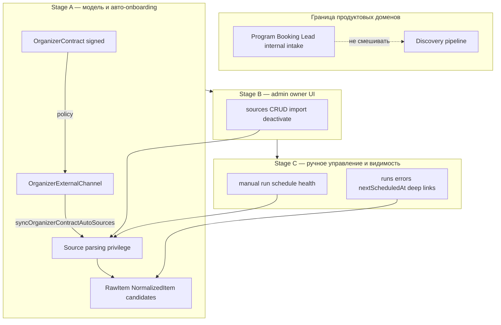

# Волна: Sources / Parsing — Owner Ops

**Статус:** основной scope волны закрыт в репозитории (итерации 1–4 + тесты rate limit); дальнейшее — по продукту (Redis для лимитов при scale-out, enrichment API каналов).  
**Связанные каноны:** [`ADR-009`](../decisions/ADR-009-source-and-channel-lifecycle.md), [`INGESTION_POLICY.md`](../INGESTION_POLICY.md), [`SOURCES_OWNER_INGESTION_RUNBOOK.md`](../operations/SOURCES_OWNER_INGESTION_RUNBOOK.md).

---

## 1. Архитектурная схема волны

Ниже — логика трёх подэтапов и граница доменов (внутренние программы платформы ≠ внешний discovery).

**Инвариант:** парсинг внешних анонсов всегда идёт через `Source` (и связанный контрактный контур `OrganizerExternalChannel`). Карточки программ, созданные в платформе (`Program`), и заявки (`Booking`) не становятся «источником» для discovery — это отдельный жизненный цикл (публикация по `INGESTION_POLICY`).

---

## 2. Правило: договор → внешние каналы → sources для parsing privilege

### 2.1 Как это работает (целевое и уже частично реализованное)

1. У организатора есть **подписанный договор** (`OrganizerContract.status === signed`) — иначе авто-источники с `sourceOrigin = organizer_contract_auto` **ставятся на паузу политикой** (`pauseContractAutoSources`), см. ADR-009.
2. Организатор (или ops) задаёт **внешние каналы** в `OrganizerExternalChannel` (telegram, instagram, vk, … + `urlOrHandle`).
3. Сервис **`syncOrganizerContractAutoSources`** ([`autoOnboardingService.ts`](../../services/api/src/modules/sources/autoOnboardingService.ts)) для каждого активного канала выполняет **upsert** записи в `Source` с:
   - `sourceOrigin = organizer_contract_auto`
   - `lifecycleState = active` (пока договор подписан и канал активен)
   - `metaJson.channelId` — связь с каналом
4. Дополнительно может подмешиваться синтетический канал из `Organizer.telegramChatId` (как сейчас в коде) — это тоже **внешний** сигнал для сбора, не `Program`.

### 2.2 Что явно не смешиваем

| Концепция | Сущности | Назначение |
|-----------|----------|------------|
| **Внутренние программы платформы** | `Program`, `ProgramMedia`, intake через формы/email | Каталог, бронирование, модерация публикации |
| **Внешний discovery** | `Source`, `OrganizerExternalChannel`, `RawItem` | Сбор анонсов/контента с внешних площадок, кандидаты на модерацию |

Правило для команды и UI: **не** создавать `Source` из `Program` автоматически; **не** показывать `Program` в реестре источников как строку парсинга. Связка «организатор» общая (`organizerId`), смысл разный.

### 2.3 «Parsing privilege» в смысле продукта

В технической модели привилегия выражается совокупностью:

- договор подписан → авто-источники могут быть активны;
- `Source.isActive` + `lifecycleState` + расписание ingestion;
- отдельно: **публикация в каталог** всё равно через модерацию (`INGESTION_POLICY`), не через «авто из RSS».

При необходимости следующий шаг — явное поле уровня доверия (например `trustScore` / флаг «contractual parsing») **без** дублирования сущности `Program`.

---

## 3. Подэтапы A / B / C — детализация

### Stage A — data model + auto source onboarding от договорного организатора

| Аспект | Содержание |
|--------|------------|
| **Таблицы / поля** | Уже есть: `Source`, `OrganizerExternalChannel`, `Organizer`, `OrganizerContract`. Возможные доработки: явный `sourceId` или FK `Source.externalChannelId` (сейчас связь часто через `metaJson.channelId`); индексы под выборки «все contract_auto по организатору»; опционально `OrganizerExternalChannel.lastSyncedToSourceAt` (частично `lastSyncedAt`). |
| **API** | Расширить/зафиксировать: вызов синка при смене контракта/каналов (`POST /internal/...` или хук из модуля организаторов — как сейчас в кодовой базе); идемпотентный upsert; read API для списка каналов с признаком «отражено в Source». |
| **Admin screens** | Минимум на Stage A: не обязательно новый экран — достаточно API + runbook; либо read-only блок на карточке организатора «каналы → источники» (опционально). |
| **Jobs / hooks** | Уже: `syncOrganizerContractAutoSources` после подписания; cron/edge при обновлении каналов. Добавить: явный триггер из админки «пересобрать источники из каналов» (может переехать в Stage B/C). |
| **Риски** | Дублирование `Source` при смене нормализации URL; гонки при параллельном импорте и синке; отсутствие договора → волна `paused_by_policy` (ожидаемо). |
| **Зависимости** | Канон контракта (`OrganizerContract.status`), ADR-009, нормализация handle в [`sourceRegistry.ts`](../../services/api/src/modules/sources/sourceRegistry.ts). |

### Stage B — admin sources UI + CRUD / deactivate / import

| Аспект | Содержание |
|--------|------------|
| **Таблицы / поля** | `SourceImportSession` / `SourceImportRow` (уже есть `sourceFormat`: xlsx | csv | json); при необходимости расширить `summaryJson` под owner-отчёты. |
| **API** | CRUD `Source`, фильтры по `lifecycleState`, `sourceOrigin`, `organizerId`; импорт batch (путь/загрузка — как в текущем API); деактивация = `isActive` + при необходимости `lifecycleState`. |
| **Admin screens** | [`apps/admin/src/app/sources/page.tsx`](../../apps/admin/src/app/sources/page.tsx): фильтры, таблица, форма, импорт, **owner-ready** подписи (канон ADR-009), ссылки на связанные сущности. |
| **Jobs / hooks** | Нет обязательных новых воркеров; опционально post-import hook «пересчитать nextScheduledAt». |
| **Риски** | Путаница в UI между «канал организатора» и «ручной источник» — снять лейблами `sourceOrigin`. |
| **Зависимости** | Завершённый Stage A для стабильных данных; JWT admin. |

### Stage C — manual ingestion controls + видимость результата

| Аспект | Содержание |
|--------|------------|
| **Таблицы / поля** | `SourceRun`, `RawItem`, очереди кандидатов — уже есть; при необходимости агрегаты в `metaJson` источника (последняя ошибка уже есть). |
| **API** | `POST` «run now» для источника (или job endpoint); GET расписание/health (`lastCheckedAt`, `nextScheduledAt`, последние runs); список ошибок без PII. |
| **Admin screens** | Кнопки «Собрать сейчас», отображение расписания и статуса последнего прогона; deep links → raw / candidates / jobs (частично может быть в других страницах админки). |
| **Jobs / hooks** | Связка с [`ingestion/service.ts`](../../services/api/src/modules/ingestion/service.ts): daily sync + ручной триггер не должен ломать идемпотентность. |
| **Риски** | Перегруз API при массовом «run now»; нужны rate limits / очередь. |
| **Зависимости** | Стабильный Stage B; мониторинг логов без PII. |

---

## 4. Затронутые модули (репозиторий)

| Область | Пути |
|---------|------|
| Модель БД | `services/api/prisma/schema.prisma`, миграции |
| Реестр и политика | `services/api/src/modules/sources/sourceRegistry.ts`, `autoOnboardingService.ts`, `importService.ts` |
| Ingestion | `services/api/src/modules/ingestion/service.ts` |
| API routes | `services/api/src/modules/sources/routes.ts`, организаторы/контракты (хуки синка) |
| Admin | `apps/admin/src/app/sources/**`, навигация `AdminNav` |
| Конфиг env | `packages/config/src/env.ts` (ингест-флаги, интервалы) |
| Документация | `docs/operations/SOURCES_OWNER_INGESTION_RUNBOOK.md`, ADR-009 |

---

## 5. Staged implementation plan (порядок работ)

1. **Stage A:** уточнить связь `OrganizerExternalChannel` ↔ `Source` (мета vs FK), зафиксировать хуки синка при signed contract и при CRUD каналов; тесты на идемпотентность; audit-события при массовой паузе.
2. **Stage B:** довести admin UI (фильтры, lifecycle, импорт JSON при отсутствии), сообщения об ошибках импорта, e2e smoke (уже есть задел `sources.smoke.spec.ts`).
3. **Stage C:** API + UI для manual run и сводки расписания; лимиты на ручные прогоны; ссылки на raw/candidates.

Детализация исполнения Stage A: [`docs/migration/WAVE1_STAGEA_SOURCES_EXECUTION_BOARD.md`](../migration/WAVE1_STAGEA_SOURCES_EXECUTION_BOARD.md).

Параллельно: обновлять runbook и не ломать **`pnpm --filter api exec tsc --noEmit`** и **`pnpm --filter admin exec tsc --noEmit`**.

---

## 6. Rollout plan

| Фаза | Действие |
|------|----------|
| **R0** | CI: обязательный `pnpm --filter @mywave/config build` до typecheck API (см. `.github/workflows/ci.yml`). |
| **R1** | Stage A за фича-флагом или только на staging: синк каналов → sources, мониторинг дублей. |
| **R2** | Stage B на staging: админы обкатывают импорт и CRUD; правки копирайта ADR-009 в UI. |
| **R3** | Stage C: включить manual run с лимитом; наблюдать нагрузку ingestion. |
| **R4** | Prod: снять флаги после 1–2 недель без инцидентов; обновить OWNER runbook. |

**Rollback:** откат миграций по БД по стандартному процессу; отключение хуков синка — флаг/env или откат деплоя API.

---

## 7. Definition of Done — Stage A

Stage A считается **готовым**, когда выполнено всё ниже:

1. **Договор signed** однозначно определяет возможность держать `Source` с `organizer_contract_auto` в активном состоянии (согласовано с ADR-009); при расторжении/не signed — пауза по политике, без «зомби»-сборов.
2. **Каналы организатора** (`OrganizerExternalChannel`) при активном договоре **стабильно отражаются** в `Source` (upsert идемпотентен по паре type + нормализованный handle).
3. **Разделение доменов** задокументировано и не нарушено в новом коде: нет автосоздания `Source` из `Program`.
4. **Audit / наблюдаемость:** ключевые переходы (создание/пауза авто-источника) логируются без PII.
5. **Регрессии:** `pnpm --filter @mywave/config build`, `pnpm --filter api exec tsc --noEmit`, `pnpm db:generate` проходят локально и в CI.
6. **Runbook** обновлён минимально: шаг «проверить каналы → sources после подписания договора».

---

## 8. Техническая дисциплина (обязательно в PR)

- Перед сборкой и в CI: **`pnpm --filter @mywave/config build`**, чтобы типы `Env` и прочие из `dist` совпадали с `src`.
- После изменений Prisma: **`pnpm --filter api db:generate`**.
- Не снижать зелёный baseline: **api** и **admin** `tsc --noEmit` без новых ошибок.

См. шаг в [`.github/workflows/ci.yml`](../../.github/workflows/ci.yml).

---

## Реализовано (Stage A — итерация 1)

| Элемент | Детали |
|---------|--------|
| FK | `Source.externalChannelId` → `OrganizerExternalChannel` (миграция `20260503120000_source_external_channel_fk`); synthetic telegram → `null`. |
| PR1 gate | Чеклист [`WAVE1_STAGEA_PR1_CHECKLIST.md`](../migration/WAVE1_STAGEA_PR1_CHECKLIST.md) — выполнен в репозитории; unit: `services/api/src/modules/sources/sourceRegistry.upsert.test.ts` (create/update/null/undefined для `externalChannelId`). |
| Upsert | `syncOrganizerContractAutoSources` передаёт `externalChannelId` для реальных каналов. |
| Хук | `PATCH /organizers/:id` при изменении **`telegramChatId`** вызывает `syncOrganizerContractAutoSources` (раньше не вызывался). |
| Ручной sync | `POST /sources/contract-auto-sync` с телом `{ "organizerId": "<id>" }` — пересборка contract-auto sources + audit `contract_auto_sources_manual_sync`. |
| Список источников | `GET /sources?includeExternalChannel=1` добавляет в ответ `externalChannel` (тип, handle, активность). |
| Admin UI | `/sources`: блок «Договорные источники» → выбор организатора + «Синхронизировать с каналами»; в таблице строка `externalChannel` для связи с каналом. |
| Runbook | [`SOURCES_OWNER_INGESTION_RUNBOOK.md`](../operations/SOURCES_OWNER_INGESTION_RUNBOOK.md) — ручной sync и FK. |

### Итерация 3 (Stage B/C UI)

| Элемент | Детали |
|---------|--------|
| API | `GET /sources?lifecycleState=<adr009>` — фильтр по lifecycle. |
| Admin `/sources` | Выпадающий список lifecycle; ссылка «Карточка организатора» на `/organizers#organizer-row-{id}`; блок «Расписание / парсинг» (next / checked / success); дедуп дат в нижнем тексте колонки. |
| `/organizers` | `id` на строке таблицы для якоря; ссылка «Источники» в шапке. |

### Итерация 4 (rate limit + hash UX)

| Элемент | Детали |
|---------|--------|
| API | `POST /sources/:id/run` — 429 `rate_limited` + `retry_after_ms` (ключ: админ + source). `POST /sources/run` — 429 для bulk; 400 если `mode=all` и активных источников &gt; `INGESTION_MANUAL_BULK_MAX_SOURCES` или список длиннее лимита. |
| Env | `INGESTION_MANUAL_RUN_MIN_INTERVAL_MS` (по умолчанию 30000), `INGESTION_MANUAL_BULK_MIN_INTERVAL_MS` (90000), `INGESTION_MANUAL_BULK_MAX_SOURCES` (40). |
| Реализация | [`manualRunRateLimit.ts`](../../services/api/src/modules/sources/manualRunRateLimit.ts) (in-memory). |
| `/organizers` | Прокрутка к `#organizer-row-{id}`, подсветка строки ~5 с, обработка `hashchange`. |

### Итерация 5 (закрытие)

| Элемент | Детали |
|---------|--------|
| Тесты | `services/api/src/modules/sources/manualRunRateLimit.test.ts` (vitest). |
| Admin | Подсказка под блоком «Принудительный прогон ingestion»: лимиты и `INGESTION_MANUAL_*` env. |
| Runbook | Раздел про rate limit / 429 / лимит активных источников при `mode=all`. |
