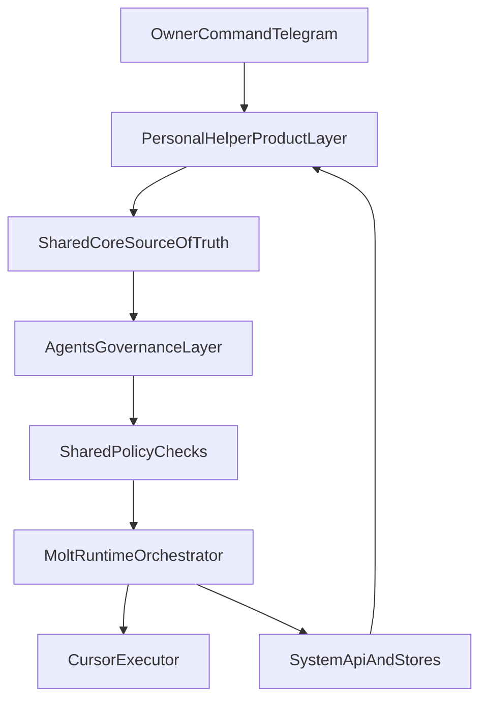

# SYSTEM CANON: Personal_Helper + Agents + Molt

Версия: 1.0  
Дата: 2026-04-17  
Статус: canonical integration contract

## 1. Что обнаружено
- Репозиторий уже содержит production ядро trust/review/incidents/score snapshots.
- Архитектура продукта частично product-first, но governance/runtime контуры еще не формализованы как отдельные слои.
- Для fair rating есть рабочие элементы, но нет единого канона взаимодействия слоев.

## 2. Почему это важно
- Без жестких boundaries система быстро превращается в смешанный слой, где policy, orchestration и UX конфликтуют.
- Для управляемой миграции трех проектов нужен единый канонический слой ответственности.

## 3. Какое решение предлагается
Принять архитектурную формулу:
- `Personal_Helper` = Product Layer (user-facing shell).
- `Agents` = Governance Layer (policy, routing, review, approvals).
- `Molt` = Runtime Layer (orchestration, execution, integrations).

Глобальные правила:
- Один Source of Truth для доменных сущностей в `shared-core`.
- Один оркестратор: `Molt`.
- Один policy owner package: `shared-policy`.
- Главный MVP канал: Telegram command/notify/approve + Cursor executor.
- Публичный рейтинг и внутренний trust score раздельны, но опираются на единые contracts.

## 4. Какие файлы/модули/папки затрагиваются
- `apps/personal-helper/` (целевой слой продукта)
- `services/agents/` (целевой governance слой)
- `services/molt/` (целевой runtime слой)
- `packages/shared-core/` (будущий общий store and registry)
- `packages/shared-schema/`
- `packages/shared-policy/`
- `docs/decisions/ADR-001-system-boundaries.md`
- `docs/decisions/ADR-002-source-of-truth.md`
- `docs/decisions/ADR-003-orchestrator.md`
- `docs/decisions/ADR-004-main-channel.md`

## 5. Что переносим как есть
- Existing booking/review/incident operational flows в `services/api`.
- Snapshot подход для score read-side.
- Admin moderation queues как операционный механизм.

## 6. Что рефакторим
- Явно выделяем контракты `Task`, `Run`, `Decision`, `Approval`, `ExecutionEvent`.
- Переносим policy/routing/approval rules из локальных модулей в `shared-policy`.
- Вводим unified ranking read-model для каталога.

## 7. Что откладываем
- Полную монорепо-консолидацию legacy кодовых баз в один релиз.
- V2+ многомерный публичный рейтинг и сложные ML сигналы.

## 8. Риски
- Дублирование памяти между слоями.
- Два оркестратора при обходе Molt runtime.
- Policy drift при локальных правилах в API/промптах.

## 9. Критерий готовности
- Все новые модули и документы ссылаются на разделение Product/Governance/Runtime.
- Любая mutation цепочка проходит через policy-check и фиксируется как auditable execution event.

## Canonical Flow

