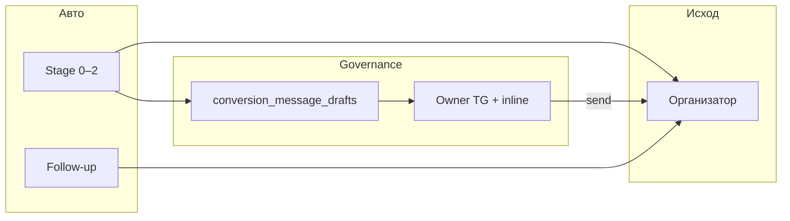

# Conversion funnel — owner approval (этапы 3–5)

Слой governance поверх автоматической воронки: **этапы 0–2 и follow-up** уходят организатору как раньше; **этапы 3–5** не доставляются без решения owner в Telegram.

## Архитектура (кратко)

1. Триггер метрик для этапа 3/4/5 → `ensureOwnerApprovalDraft` создаёт/обновляет запись `conversion_message_drafts` (`dedupeKey` = один черновик на программу+этап).
2. В `TELEGRAM_ALERT_CHAT_ID` уходит сообщение с превью и кнопками `send_draft` / `rewrite_draft` / `reject_draft` / `defer_draft`.
3. Telegram шлёт `callback_query` на `POST /public/conversion-funnel/governance/:secret/telegram`.
4. **Send** → доставка организатору (`deliverConversionCustomMessage`), запись `program_conversion_deliveries`, обновление `program_conversion_states`, `draft.status=sent`, audit.
5. Если уведомление owner в Telegram недоступно — черновик остаётся `awaiting_owner`; организатору ничего не уходит.

## Admin UI (операционный UX)

- Список: **`/admin/conversion-drafts`** — таблица, фильтры `status`, `stage`, `programId`, `organizerId`, сверху счётчики awaiting / deferred / rejected / sent today (UTC).
- Карточка: **`/admin/conversion-drafts/:id`** — полный текст, метрики JSON, audit-история, состояние доставки при `sent`; textarea + «Сохранить текст»; кнопки Send, Reject, Defer (выбор часов 6–168), Reopen (для `rejected` / `deferred`), «Обновить состояние».
- Deep-link с программ: со страницы **Programs** и **Economics · программа** — ссылка «Conversion drafts» с `?programId=…`.

## Rollout

1. Задать `TELEGRAM_BOT_API_BASE_URL`, `TELEGRAM_ALERT_CHAT_ID`, `CONVERSION_TELEGRAM_WEBHOOK_SECRET`.
2. Зарегистрировать webhook в BotFather на URL API (HTTPS) с секретом в path.
3. Миграция БД: `pnpm db:migrate`.
4. Поднять этапы 3+ только когда готовы к owner-процессу: `CONVERSION_ALLOWED_MAX_STAGE` ≥ 3 и флаги stage 4/5 по плану.

## Стадии

| Этапы | Режим |
|--------|--------|
| 0, 1, 2, follow-up | Автодоставка (при существующих ограничениях cooldown / rollout) |
| 3, 4, 5 | Только через черновик + owner (Telegram + при необходимости PATCH админки) |

## QA-сценарии

- Создание черновика при пороге stage 3 (без записи `stage3SentAt` до Send).
- Approve (Send) → доставка + `sent` + audit.
- Rewrite (callback) → инструкция + статус `edited` → PATCH текста → Send.
- Reject → `rejected`, повторный черновик с тем же `dedupeKey` не создаётся.
- Defer → `deferred` + `deferredUntil`; после окна — повторное уведомление owner (тик `run-conversion-funnel`).
- Dedupe: второй тик не создаёт второй draft.
- TTL: по истечении `expiresAt` автосенда нет (статус можно смотреть в админке).
- Telegram owner недоступен: черновик есть, `awaiting_owner`, организатор без авто.
