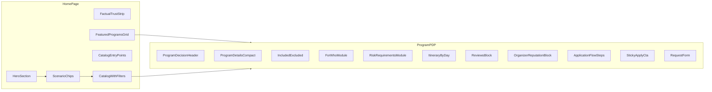

# Карта компонентов и data-contract (Russia + factual trust)

Связь с планом: целевая декомпозиция UI для последующей реализации в [`apps/web`](../../apps/web) и при необходимости расширения [`services/api`](../../services/api).

---

## 1. Диаграмма потока (логическая)

---

## 2. Таблица компонентов

| Компонент (целевой) | Назначение | Источник сейчас / рефактор | Минимальные данные (props / API) |
|---------------------|------------|----------------------------|----------------------------------|
| `HeroSection` | Россия + спорт, H1/H2, CTA, фон | `home-page.tsx` header + `pilotLanding.hero` + `HeroHotOfferSpotlight` / `HeroFilmstrip` | `heroCopy`, `primaryCta`, `secondaryCta`, `backgroundMedia`, опционально `metrics[]` |
| `FactualTrustStrip` | 4 факта без обещаний | Заменить контент `TrustBar` + `trustCards` | `items: { title, text }[]` статично или из CMS |
| `ScenarioChips` | Быстрые пресеты | Новый | `scenarios: { id, label, query }[]` → URL searchParams |
| `FeaturedProgramsGrid` | 3–6 карточек × ряды | Логика из `hotOfferSlides` + отдельные пресеты | `ProgramCardProgram[]` по endpoint или клиентский slice |
| `CatalogEntryPoints` | 4 входа + теги регионов | Новый | Статический список регионов/форматов + ссылки с query |
| `SiteNavRussia` | Верхнее меню ТЗ | Расширить `SiteHeader` или вынести nav | `items: { label, href }[]` |
| `ProgramDecisionHeader` | Above-fold PDP | Первый блок `program/[id]/page.tsx` | `title, discipline, region, exactLocation, startDate, endDate, durationDays, formatType, levelRequired, priceFromRub, currency, ratingAvg?, reviewCount?, ctaLabel` |
| `ProgramDetailsCompact` | Сетка фактов | Часть `Ключевые параметры` + новые поля | См. раздел 3 «пробелы» |
| `IncludedExcluded` | Две колонки | `inclusions`, `exclusions` | Строки или `string[]` после парсинга |
| `ForWhoModule` | Для кого | `audienceFit` | string (markdown запрещён в wireframe; в UI — структурировать позже) |
| `RiskRequirementsModule` | Риск и ограничения | `riskLevel`, `gearRequirements`, `medicalLimitations`, organizer summaries | как сейчас + явные поля страховки если появятся |
| `ItineraryByDay` | День 1…N | `itineraryDayByDay` | **Сейчас:** одна строка. **Цель:** `days: { day, title, bullets[], time?, image? }[]` — новое поле API или парсер |
| `ReviewsBlock` | Отзывы участников | `GET /reviews/public` | `id, rating, comment, createdAt` + будущее: `helpfulScore, organizerReply, verifiedCompletedTrip` |
| `OrganizerReputationBlock` | Профиль без «надёжный» | `organizer`, `organizerName` | `displayName, photoUrl?, bio?, disciplines[], memberSince, reviewCount, ratingAvg, completedProgramsCount, programsLink, askQuestionHref` — часть полей **нет в API** |
| `ApplicationFlowSteps` | 3–4 шага | `whatHappensAfterBooking` + статичный шаблон | string или `steps[]` |
| `StickyApplyCta` | Sticky конверсия | Новый | цена, ближайшая дата, CTA, подстрочник |
| `RequestForm` | Заявка | существующая форма `#request` | как `POST /bookings` сегодня |

---

## 3. Data-contract: уже есть (программа публичная)

По [`apps/web/src/app/program/[id]/page.tsx`](../../apps/web/src/app/program/[id]/page.tsx) и типу `Program`:

- Идентификация: `id`, `title`, `discipline`, `region`, `exactLocation`
- Расписание: `startDate`, `endDate`, `durationDays`
- Коммерция: `priceFromRub`, `currency`
- Участник: `formatType`, `levelRequired`, `riskLevel`, `audienceFit`
- Контент: `itineraryDayByDay`, `inclusions`, `exclusions`, `gearRequirements`, `medicalLimitations`, `cancellationRules`
- Организатор (частично): `organizerName`, `organizer.{ id, displayName, verificationStatus, certificatesSummary, insuranceSummary, emergencyPlanSummary, equipmentSummary }`
- Прочее: `trustReason`, `whatHappensAfterBooking`, `cta`, `platformTravelTips`, `media[]`

Каталог [`home-page.tsx`](../../apps/web/src/app/home-page.tsx): те же базовые поля + `organizer.reviewCount`, `organizer.ratingAvg`, `isStarred`, `spotsAvailable`.

---

## 4. Пробелы относительно ТЗ (нужны в backend / контенте)

| Требование ТЗ | Статус |
|---------------|--------|
| Средняя оценка и число отзывов **на карточке программы** | В PDP сейчас отзывы по программе есть; **агрегат рейтинга программы** в шапке — уточнить (возможно считать из `reviews`) |
| «На платформе с [дата]» для организатора | Нет поля `organizer.createdAt` в клиентском типе — добавить в API |
| «Завершённых программ через платформу: N» | Нет публичного поля — агрегат по организатору |
| «Задать вопрос» организатору | Нет маршрута — mailto / чат / форма |
| Ответ организатора на отзыв | Нет в `PublicReview` — расширить модель |
| Фильтр отзывов по свежести / полезности | Нет API — расширить |
| Плашка «Отзыв после завершённой поездки» | Нет флага в отзыве — связать с booking status |
| Программа по дням структурно | Нет схемы — контент-миграция или новое JSON-поле |
| Индекс полноты карточки (внутренний) | Опционально; в UI не как verified-badge |

---

## 5. URL и фильтры (Russia-only)

- Заменить семантику `?country=` на `?region=` или `?cluster=` (миграция URL: редирект со старых ссылок).
- Значения пресетов `ScenarioChips` → те же query, что и у каталога (`discipline`, `nearest`, `season`, тег «с детьми» — когда появится поле/тег).

---

## 6. Приёмка карты

- [ ] У каждого нового блока есть owner-компонент и список полей.
- [ ] Все поля без данных имеют нейтральный empty state из ТЗ.
- [ ] Trust-сигналы не сильнее данных с API (см. `.cursor/rules/web-apps.mdc`).
